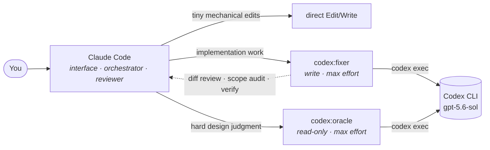

<div align="center">

# cccodex

**Claude Code as the brain, Codex as the hands.**

A Claude Code plugin that keeps Claude as the interface, orchestrator, and reviewer — while softly routing implementation-heavy work to OpenAI's [Codex CLI](https://developers.openai.com/codex/cli/).

[](LICENSE)
[](https://docs.anthropic.com/en/docs/claude-code/plugins)
[](https://developers.openai.com/codex/cli/)
[](docs/BENCHMARK.md)

</div>

---

## Why

Two agentic CLIs, two subscriptions, one keyboard. Instead of alt-tabbing between them, cccodex wires them into a single division of labor:

- **Claude** owns the conversation: spec clarity, task decomposition, diff review, verification, judgment.
- **Codex** owns the keystrokes: feature work, refactors, multi-file changes, tests.

The routing is deliberately **soft** — no denied tools, no hard pipeline. Claude can still make tiny direct edits; gentle hooks nudge it to delegate when a change grows into real implementation work. And everything Codex produces gets **reviewed and verified by Claude before it reaches you**.



## What it adds

### Agents

| Agent | Use for | Codex effort | Sandbox |
|---|---|---|---|
| `codex:fixer` | features, refactors, multi-file changes, tests, uncertain fixes | `gpt-5.6-sol` max by default | workspace-write |
| `codex:oracle` | design trade-offs, second opinions, risk analysis, adversarial review | `gpt-5.6-sol` max by default | read-only |

Exploration and research stay with Claude itself — earlier releases shipped `codex:explorer` and `codex:librarian` agents for those roles, but in practice Claude's own search tools cover them, so 0.3.0 removed them.

`codex:fixer` is the heart of the plugin and is built as a **gatekeeper, not a forwarder**: it has no edit tools at all. It snapshots a baseline of the working tree, composes a tightly scoped prompt, delegates to `codex exec`, then audits the result — out-of-scope edits get restored from the baseline, the in-scope diff gets reviewed, and the task's verification command gets re-run — before anything is reported back.

### Commands

| Command | What it does |
|---|---|
| `/codex-implement <task>` | manually delegate implementation to `codex:fixer` |
| `/codex-review [uncommitted\|base <branch>\|commit <sha>]` | Codex second-opinion review of a diff; Claude triages each finding against the actual diff |

### Hooks

| Hook | Fires on | Purpose | Cost |
|---|---|---|---|
| routing nudge | every user prompt | reminds Claude of the routing rubric | ~18 ms |
| post-edit nudge | every Edit/Write | flags when direct edits accumulate (~20+ lines at once, or ~60+ lines / 3+ files drip-fed) | ~21 ms |
| scope audit | `codex:fixer` finishing | warn-only content/mode/link comparison against the task-start baseline; flags out-of-scope changes, never restores files | — |

The routing rules live entirely inside the plugin — nothing is written to your `CLAUDE.md` or project settings.

## Install

Inside Claude Code:

```text
/plugin marketplace add foxytanuki/cccodex
/plugin install codex@cccodex
```

For local development, register a clone's working tree instead — the install live-references it, so hook edits take effect immediately and agent edits on the next session:

```text
/plugin marketplace add ~/dev/personal/cccodex
/plugin install codex@cccodex
```

### Requirements

- [Codex CLI](https://developers.openai.com/codex/cli/) installed and on `PATH`, with `codex login` completed (ChatGPT auth).
- CLI argument compatibility checked with **codex-cli 0.159.2**; earlier benchmark runs used 0.136.0. The agents depend on that release's `codex exec` flag semantics — `--json`, `-o/--output-last-message`, `-c key=value`, `-s` sandbox modes, `--skip-git-repo-check` — Model access and authenticated end-to-end delegation must still be checked on each host; on other CLI versions, confirm flag compatibility first.
- Python 3.8+ (for the hooks and JSON event parsing).
- Claude Code with background Bash tasks, Read, and TaskStop (documentation checked against 2.1.285).

The agents default to `gpt-5.6-sol` / `max`; set `CCCODEX_MODEL` and
`CCCODEX_EFFORT` to choose explicit alternatives. No automatic fallback occurs.
The built-in `/codex-review` uses the host's configured review/default model.
Fixer permits one initial run plus at most one audited corrective resume, and
compares changes against task-start copies to distinguish them from user WIP.

## Usage

Use Claude Code normally. That's the point.

For small obvious edits, Claude proceeds directly. When a task becomes implementation-heavy, Claude spawns `codex:fixer` on its own (the hooks keep it honest). You can also route explicitly:

```text
/codex-implement add retry with exponential backoff to the fetch client
/codex-review base main
use codex:oracle to judge whether this migration is safe to ship
```

## How it compares to openai/codex-plugin-cc

OpenAI ships an official plugin for the same pairing: [openai/codex-plugin-cc](https://github.com/openai/codex-plugin-cc). The v0.2.0 / codex-cli 0.136.0 benchmark compared the two head-to-head — 5 trials per task per plugin on identical fixture tasks, pinned to the same model/effort/tier (`gpt-5.5`, medium, fast) — full methodology, numbers, and caveats in **[docs/BENCHMARK.md](docs/BENCHMARK.md)**.

| Task (fresh repo, externally verified, mean of 5) | cccodex | codex-plugin-cc |
|---|---|---|
| T1 — one-line bugfix | 15.0 s ✅ | 15.8 s ✅ |
| T2 — implement `slugify()` vs failing tests | 18.4 s ✅ | 19.2 s ✅ |
| T3 — multi-file feature (store + CLI) | 21.8 s ✅ | 20.9 s ✅ |
| Tokens per task | ~62–80 k in / 0.4–0.8 k out | ~62–80 k in / 0.4–0.8 k out |

**Raw delegation performance is a wash** — same backend, equivalent results (30/30 pass), near-identical token usage, wall-clock differences inside per-trial variance (the official plugin's persistent app-server broker answers a warm no-op ~1.3 s faster; its first call pays a ~5 s broker spawn instead). What you're actually choosing between is workflow:

| | **cccodex** | **openai/codex-plugin-cc** |
|---|---|---|
| Trigger | ambient — hooks nudge Claude to delegate on its own | explicit — `/codex:rescue`, `/codex:review` slash commands |
| After Codex finishes | Claude **reviews the diff, audits scope, re-runs verification** | output returned **verbatim** (thin forwarder by design) |
| Role coverage | write (fixer) + read-only review (oracle) | task delegation + 2 review commands |
| Background jobs | no | yes — status / result / cancel / resume |
| Runtime | markdown + 3 small Python hooks | Node.js ≥ 18.18 + app-server broker |

Rule of thumb: pick **cccodex** if you want delegation to be the ambient default with a verification layer on top of everything Codex writes; pick the **official plugin** if you want explicit, on-demand Codex calls with first-class background-job management. They're not mutually exclusive — though both claim the `codex:` namespace, so expect overlapping agent lists if you install both.

## Design notes: why `codex exec`, not the app server

The official plugin wraps the persistent [Codex app server](https://developers.openai.com/codex/app-server); cccodex deliberately shells out to a fresh `codex exec` per task:

- **Parallel subagents.** Each agent owns its process. A shared app-server broker serializes turns — the official broker rejects a second concurrent client with a `busy` error — which conflicts with running fixer / oracle alongside each other.
- **Stateless failure model.** A hung or crashed call affects that one call. No daemon lifecycle (spawn, health, stale sockets, restarts) to manage.
- **The win is small.** Measured head-to-head, a warm broker saves ~1.3 s of fixed overhead per call — noise next to model time ([docs/BENCHMARK.md](docs/BENCHMARK.md)).

Runs use Claude Code background Bash tasks with their own IDs and output paths. Automatic model/effort retries are disabled; every failed/cancelled delegation is audited before any further work. Agent compliance with these instructions still needs end-to-end verification. If long-running fixer tasks ever need first-class resume/interrupt, the candidate design is an app-server broker **per agent invocation**, not a shared one.

## Optional strict mode (not installed by the plugin)

If soft routing is too soft for your taste, add to `.claude/settings.json` (or `.claude/settings.local.json` to keep it personal):

```json
{
  "permissions": {
    "ask": ["Edit", "Write", "MultiEdit"]
  }
}
```

`"ask"` keeps a human approval in the loop for Claude's direct edits without hard-denying them — tiny edits remain possible under supervision, while `codex:fixer` (which has no edit tools) becomes the friction-free path. A hard `"deny"` variant exists but works against the plugin's soft-routing intent. The plugin never ships this enabled.

## Safety design

Delegating writes to a second agent in a possibly-dirty working tree is the dangerous part, so the fixer treats the tree it found at task start — not HEAD — as the canonical baseline:

- **git is read-only** for every agent: `diff/show/log/status/grep/blame` only. `stash`, `checkout`, `restore`, `reset`, `clean`, and friends are banned by any means, including instructing Codex to run them.
- **Baseline snapshots**: the fixer copies every dirty and in-scope file before delegation, preserving symlinks, and fingerprints tracked/untracked files. Snapshot directories are private. A clean out-of-scope file may have a fingerprint but no copied content; if changed, report it rather than reconstructing its content from Git.
- **Scope audit**: after each fixer run, a deterministic `SubagentStop` hook compares task-start file fingerprints with current content, permissions, symlink targets, and presence. This catches changes to already-dirty files too. It only warns and never restores files. Same-checkout concurrent runs still share a newest-manifest heuristic; submodule contents need separate verification.

## License

[MIT](LICENSE)

The Git/scope rules are agent instructions plus a warn-only audit, not enforced
write isolation. Uncertain attribution is reported instead of automatically
undoing another writer's work. Ignored files and submodule contents need separate
verification.

## Local validation

```sh
claude plugin validate plugins/codex
python3 -m unittest discover -s tests -v
```

These checks cover the plugin manifest and isolated hook regressions, including
already-dirty files, unusual filenames, permissions, and symlinks. They do not
prove model access, authenticated delegation, or Claude's compliance with the
agent prompts on another host.
